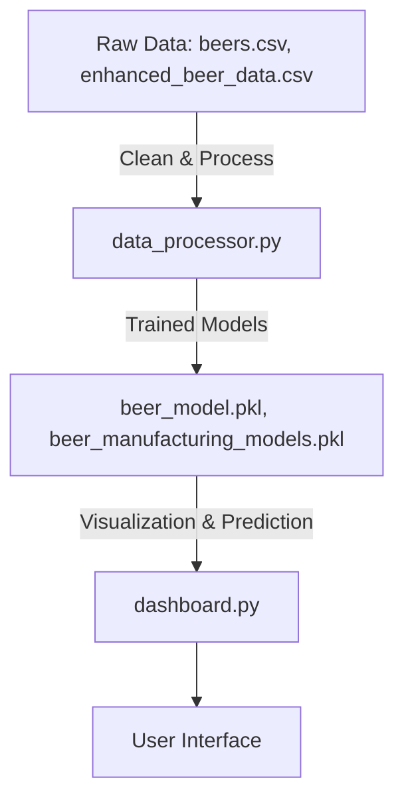

<h1 align="center">Beer Manufacturing Analysis</h1>


<h2 align="center">
   <a href="https://banomaly.streamlit.app/" target="_blank">
      <b>🚀 TRY THE LIVE STREAMLIT APP</b>
   </a>
</h2>


This project provides a complete pipeline for analyzing beer manufacturing data, building predictive models, and visualizing results through an interactive dashboard. It helps breweries and analysts gain insights into production processes, improve efficiency, and make data-driven decisions using real-world datasets and machine learning models.

## Features
- Data processing and cleaning (`data_processor.py`)
- Predictive modeling (`beer_model.pkl`, `beer_manufacturing_models.pkl`)
- Interactive dashboard (`dashboard.py`)
- Example datasets (`beers.csv`, `enhanced_beer_data.csv`)

## Project Workflow


## Getting Started
1. Install dependencies:
   ```bash
   pip install -r requirements.txt
   ```
2. Run data processing:
   ```bash
   python data_processor.py
   ```
3. Launch dashboard:
   ```bash
   streamlit run dashboard.py
   ```

## Requirements
- Python 3.8+
- See `requirements.txt` for details
